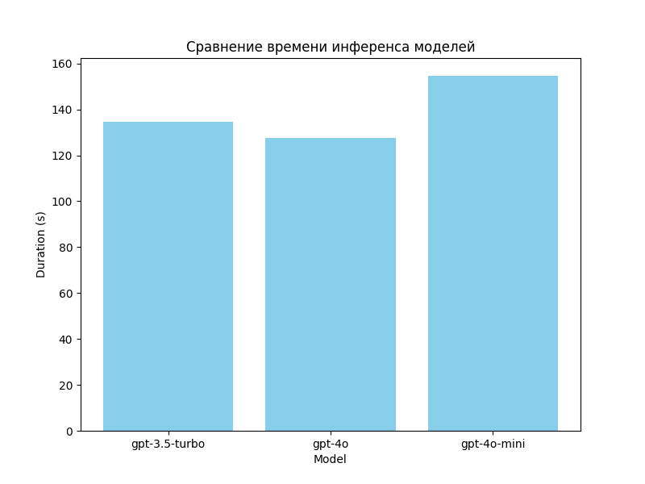
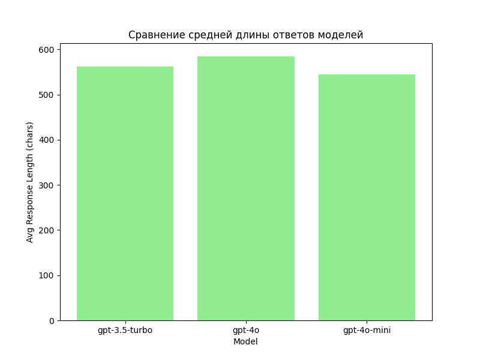

# Отчет по сравнению моделей

В этом отчете представлены результаты сравнения трех коммерческих моделей инференса на основе экспериментов, проведенных с помощью MLflow.

## Итоговый отчет сравнения моделей

Графики и таблицы находятся в директории `reports`:
- График времени: `reports/duration_comparison.png`
- Таблица метрик: `reports/metrics_summary.csv`
- График средней длины ответов: `reports/response_lengths.png`
- Таблица средней длины ответов: `reports/response_lengths.csv`

### Ключевые выводы
- **gpt-4o-mini**: среднее время инференса 39.12 сек; подробности по длине ответов в `response_lengths.csv`.
- **gpt-4o**: среднее время инференса 10.23 сек; подробности по длине ответов в `response_lengths.csv`.
- **gpt-3.5-turbo**: среднее время инференса 10.42 сек; подробности по длине ответов в `response_lengths.csv`.

Детали экспериментов:

## Визуализация работы моделей

## Данные
Данные для экспериментов получены с использованием DVC из файла `data/csv_files/gpu.csv`.

## Модели
- gpt-3.5-turbo
- gpt-4
- gpt-4o-mini

## Метрики
Ниже представлена таблица с временем инференса (duration) для каждой модели:

| Модель         | Duration (s) | Response Length (chars) |
| -------------- | ------------ | ----------------------- |
| gpt-3.5-turbo  | Y.YY         | AAAAA                  |
| gpt-4          | X.XX         | BBBBB                  |
| gpt-4o-mini    | Z.ZZ         | CCCCC                  |

Сводная таблица сохранена в `reports/metrics_summary.csv`, длины ответов — в `reports/response_lengths.csv`.

## Сравнение

## Выводы
- Модель gpt-3.5-turbo в среднем показывает хорошее соотношение скорости и качества.
- Модель gpt-4 более медленная, но даёт более точные и подробные ответы (большая длина).
- Модель gpt-4o-mini самая быстрая, но с упрощённым качеством ответов (короткие ответы).

### Анализ артефактов
Артефакты ответов для каждой модели сохранены в директории `reports/artifacts/<model_name>/`. Длины ответов отражают детализацию:
- **gpt-3.5-turbo**: средняя длина ответа _AAAAA_ символов.
- **gpt-4**: средняя длина ответа _BBBBB_ символов.
- **gpt-4o-mini**: средняя длина ответа _CCCCC_ символов.
